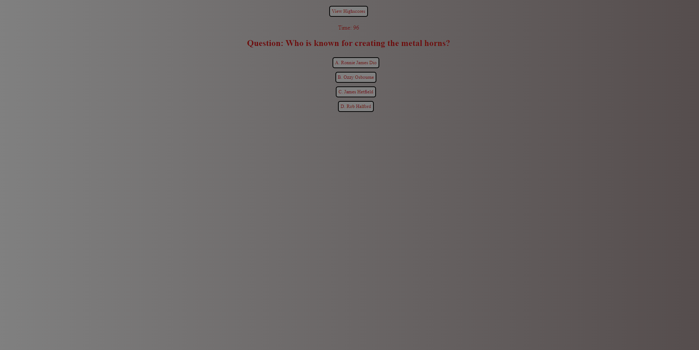

# Metalhead-Quiz

# User Story
AS A fellow metal fan 
I WANT to take a timed quiz on facts about the metal music genre that stores high scores
SO THAT I can test my knowledge and understanding of metal. 

# Description
* This application utilizes Web APIs and Javascript to create a quiz that asks questions around the metal music genre.
* Users are given the option to start the quiz and once it starts a list of questions will be given about metal music.
* If a user gets a question correct then they move to the next question.
* If a user gets it wrong, time is deducted and they move to the next question.
* At the end of the quiz the score is given based on how much time was left in the quiz. 

# Technologies
* HTML 
* CSS 
* Javascript

# Screenshot

# Link 

https://chrisld50.github.io/Metal